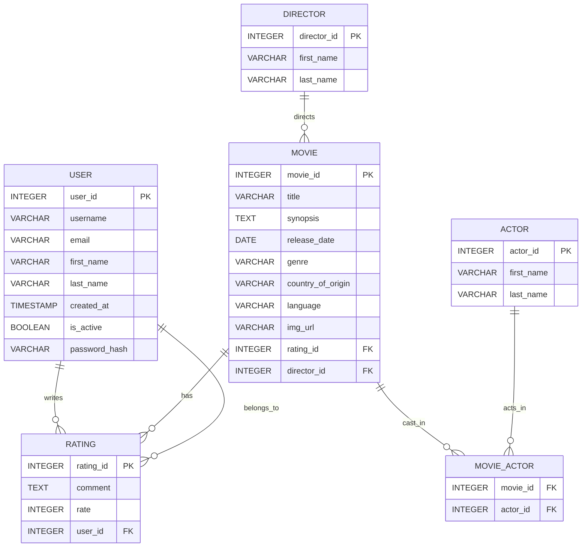

# sv

Everything you need to build a Svelte project, powered by [`sv`](https://github.com/sveltejs/cli).

## Creating a project

If you're seeing this, you've probably already done this step. Congrats!

```sh
# create a new project in the current directory
# Movie DB (SvelteKit)

Lightweight movie database demo built with SvelteKit and SQLite.

**Status:** Prototype / local demo

**What this repo contains:**
- **Frontend:** SvelteKit app in `src/routes` and `src/lib`.
- **Server / DB:** lightweight SQLite DB and helper scripts in `src/lib/server`.

**Quick Links:**
- **DB file:** `src/lib/server/movie.db`
- **DB helpers:** `src/lib/server/createDb.js`, `src/lib/server/createTable.js`, `src/lib/server/sql.js`

**Tech stack:**
- **SvelteKit** (UI)
- **Node.js** (server-side routes)
- **SQLite** (local database via `sqlite3`)

**Features:**
- Movie, director, actor, user and rating tables.
- Many-to-many relation between movies and actors (`movie_actor`).

**Prerequisites**
- Node.js (v16+ recommended)
- npm (or pnpm/yarn)

**Install & Run (Windows bash / WSL)**
```bash
git clone <repo-url>
cd movie_db_sveltekit
npm install
npm run dev
```

Open http://localhost:5173 (or the port shown by the dev server).

**Build / Preview**
```bash
npm run build
npm run preview
```

**Database**
- The app uses SQLite located at `src/lib/server/movie.db` (created by `createDb.js`).
- Table creation is handled by `src/lib/server/createTable.js`.

Schema summary (columns shown with primary keys and foreign keys):

- `user`
	- `user_id` INTEGER PRIMARY KEY AUTOINCREMENT
	- `username` VARCHAR(50) NOT NULL UNIQUE
	- `email` VARCHAR(100) NOT NULL UNIQUE
	- `first_name`, `last_name` VARCHAR(50)
	- `created_at` TIMESTAMP DEFAULT CURRENT_TIMESTAMP
	- `is_active` BOOLEAN DEFAULT 1
	- `password_hash` VARCHAR(255) NOT NULL

- `rating`
	- `rating_id` INTEGER PRIMARY KEY AUTOINCREMENT
	- `comment` TEXT
	- `rate` INTEGER CHECK(rate >= 1 AND rate <= 5)
	- `user_id` INTEGER REFERENCES `user`(`user_id`)

- `director`
	- `director_id` INTEGER PRIMARY KEY AUTOINCREMENT
	- `first_name`, `last_name` VARCHAR(100) NOT NULL

- `actor`
	- `actor_id` INTEGER PRIMARY KEY AUTOINCREMENT
	- `first_name`, `last_name` VARCHAR(100) NOT NULL

- `movie`
	- `movie_id` INTEGER PRIMARY KEY AUTOINCREMENT
	- `title` VARCHAR(100) NOT NULL
	- `synopsis` TEXT
	- `release_date` DATE
	- `genre`, `country_of_origin`, `language` VARCHAR(50)
	- `img_url` VARCHAR(255)
	- `rating_id` INTEGER REFERENCES `rating`(`rating_id`)
	- `director_id` INTEGER REFERENCES `director`(`director_id`)

- `movie_actor` (join table)
	- `movie_id` INTEGER REFERENCES `movie`(`movie_id`)
	- `actor_id` INTEGER REFERENCES `actor`(`actor_id`)
	- PRIMARY KEY (`movie_id`, `actor_id`)

**ER Diagram (Mermaid)**
This diagram can be rendered on GitHub or with Mermaid-enabled renderers.



**Notes / maintenance**
- If `src/lib/server/movie.db` does not exist, the `createDb.js` script opens/creates it automatically when server-side code runs.
- To (re)create tables, run the `createTable.js` script (it executes on import). Be careful: repeated runs are guarded with `CREATE TABLE IF NOT EXISTS` but manual DB resets require removing the `.db` file.
- There is no top-level `LICENSE` file in this repo (checked `src/lib/server` for license; none found). Add a `LICENSE` to the repo root if you want to publish with a specific license.


